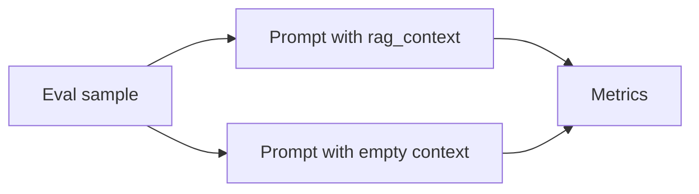

# Flow of Information

This document expands the README flow section and clarifies where RAG is applied and how feature flags branch execution.

## Where RAG is applied

- Training-time RAG: used when building training examples (for example in `scripts/e2e_smoke.py`) by retrieving context and embedding it in each example before SFT.
- Inference-time RAG: used at prompt construction time in `TripodOrchestrator.execute("inference", ...)` and in the smoke evaluation loops.

The benchmark "with_rag" vs "without_rag" is always an inference-time toggle. Training may still include RAG-enriched examples depending on `rag.training.enabled`.

## Inference path (TripodOrchestrator.execute("inference"))

```mermaid
flowchart LR
  Input[Input payload] --> RAG[RAGLeg (if rag.inference.enabled)]
  RAG --> Prompt[PromptLeg (raw or dspy)]
  Prompt --> Output[Prompt text or prediction]
```

- `rag.inference.enabled: false` makes `RAGLeg.run` return an empty context string.
- `prompting.backend: raw` returns a rendered prompt string.
- `prompting.backend: dspy` returns a DSPy prediction string (requires `dspy.settings.configure(lm=...)`).
- `main.py` does not call an LLM; it prints the prompt or DSPy output as a placeholder.

## Training path (TrainingLeg.run + smoke pipeline)

```mermaid
flowchart TD
  Dataset[Train examples] --> RAG[RAGLeg (if rag.training.enabled)]
  RAG --> SFT[Build SFT text]
  SFT --> Train[TrainingLeg (LoRA/QLoRA)]
  Train --> Adapter[Adapter output]
```

- In `scripts/e2e_smoke.py`, RAG is used to enrich each training example before SFT when `rag.training.enabled` is true.
- `training.hyperparameters.response_marker` and `training.hyperparameters.mask_prompt` control how prompt tokens are masked during loss.
- Training is offline; it is not interleaved with inference.

## Evaluation path (scripts/e2e_smoke.py)



- Four passes are computed: `base_with_rag`, `base_without_rag`, `tuned_with_rag`, `tuned_without_rag`.
- `--holdout-policies` makes test policy IDs unseen in training, which increases reliance on retrieval.

## Branchouts and feature flags

### Config toggles (YAML)

- `training.enabled`: skip training entirely when false.
- `rag.training.enabled` / `rag.inference.enabled`: skip ingestion and return empty context when false.
- `rag.training.retrieval.top_k` / `rag.inference.retrieval.top_k` and `rag.*.retrieval.strategy`: affect retrieval behavior.
- `prompting.backend`: `raw` (rendered prompt) vs `dspy` (DSPy program output).
- `prompting.dspy.include_user_prompt`, `prompting.dspy.chain_of_thought`, `prompting.dspy.output_field`: DSPy behavior switches.
- `training.hyperparameters.response_marker` and `training.hyperparameters.mask_prompt`: SFT prompt/completion masking.

### Script flags (smoke)

- `scripts/e2e_smoke.py`: `--holdout-policies`, `--save-predictions`, `--eval-samples`, `--report-dir`, `--n`, `--num-policies`, `--train-policy-ratio`, `--test-ratio`, `--seed`.
- `scripts/generate_smoke_dataset.py`: `--holdout-policies` controls train/test policy ID overlap in the synthetic dataset.

### Notes on implementation coverage

- `prompting.few_shot` is not used by `core/prompting.py`; few-shot usage appears in `scripts/smoke_cross_section.py` only.
- `rag.*.retrieval.score_threshold`, `rag.*.retrieval.reranking`, and `rag.*.ingestion.chunk_size/chunk_overlap` are present in `configs/iot_domain_config.yaml` but are not wired in `core/rag.py`.
- `TripodOrchestrator.evaluate` is a placeholder; the real end-to-end evaluation is in `scripts/e2e_smoke.py`.
