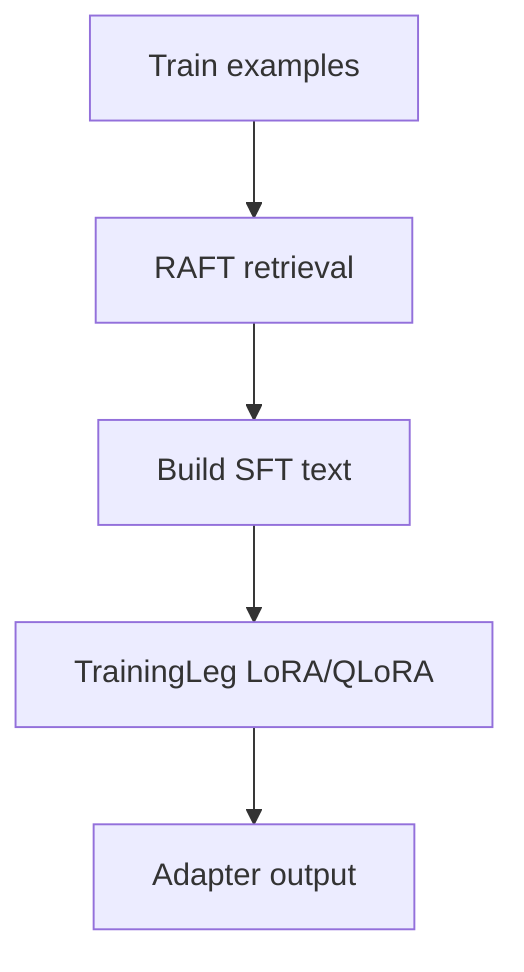
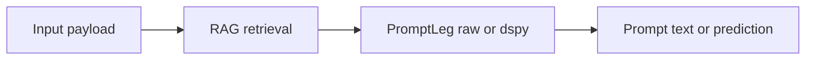
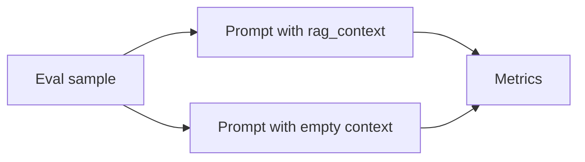

# Flow of Information

This document expands the README flow section and clarifies how the legs connect.

## Training path (TrainingLeg.run + smoke pipeline)

- In `tests/smoke_e2e.py`, RAFT (training-time retrieval) enriches each training example before SFT when `raft.enabled` is true.
- `training.hyperparameters.response_marker` and `training.hyperparameters.mask_prompt` control loss masking: the prompt portion is ignored in the labels (`-100`) so only the completion contributes to loss (attention still sees the full prompt).

## Inference path (TripodOrchestrator.execute("inference"))

- `rag.enabled: false` makes `RAGLeg.run` return an empty context string.
- `prompting.backend: raw` returns a rendered prompt string.
- `prompting.backend: dspy` returns a DSPy prediction string (requires `dspy.settings.configure(lm=...)`).
- `main.py` does not call an LLM; it prints the prompt or DSPy output as a stub.

## Evaluation path (tests/smoke_e2e.py)

- Pass naming and metrics are defined by the evaluation script and are task-specific.
- When `raft.enabled` is true, the smoke script trains both no-RAFT and RAFT adapters and evaluates each under the same inference-time RAG toggle.
- `--holdout-policies` makes test policy IDs unseen in training, which increases reliance on retrieval.
 - `TripodOrchestrator.execute("evaluate")` loads `evaluation.entrypoint` and dispatches to `evaluation.evaluator`; when unset, it falls back to the stub evaluator.

## RAFT and RAG

### When retrieval is applied

- **RAFT (training-time retrieval)**: used when building training examples (for example in `tests/smoke_e2e.py`) by retrieving text and concatenating it into each example before SFT.
- **RAG (inference-time retrieval)**: used at prompt construction time in `TripodOrchestrator.execute("inference", ...)` and in the smoke evaluation loops.
- The benchmark "with_rag" vs "without_rag" is always an inference-time toggle. RAFT vs no-RAFT tuning is controlled by `raft.enabled` and reflected in the tuned pass names.

## Branchouts and feature flags

### Config toggles (YAML)

- `training.enabled`: skip training entirely when false.
- `training.hyperparameters.response_marker` and `training.hyperparameters.mask_prompt`: SFT prompt/completion masking.
- `raft.enabled` / `rag.enabled`: skip ingestion and return empty context when false.
- `raft.retrieval.top_k` / `rag.retrieval.top_k` and `raft.retrieval.strategy` / `rag.retrieval.strategy`: affect retrieval behavior.
- `prompting.backend`: `raw` (rendered prompt) vs `dspy` (DSPy program output).
- `prompting.dspy.include_user_prompt`, `prompting.dspy.chain_of_thought`, `prompting.dspy.output_field`: DSPy behavior switches.
- `evaluation.entrypoint` / `evaluation.evaluator`: evaluator module hook and registry key for pipeline-specific evaluation.

### Script flags (smoke)

- `tests/smoke_e2e.py`: `--holdout-policies`, `--save-predictions`, `--eval-samples`, `--report-dir`, `--n`, `--num-policies`, `--train-policy-ratio`, `--test-ratio`, `--seed`.
- `tests/generate_smoke_dataset.py`: `--holdout-policies` controls train/test policy ID overlap in the synthetic dataset.

For config-to-runtime details, see `configs/README.md`.
