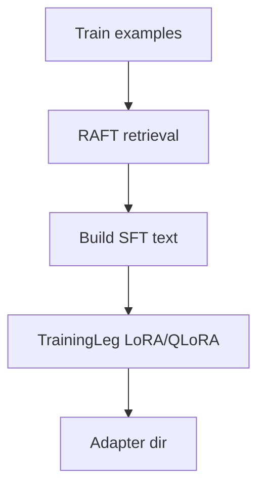
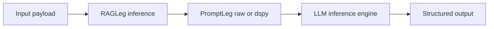

# LLM Tripod

Tripod is a small, modular **LLM integration-test harness** that separates the pipeline into three “legs”:

1. **Training (Leg 1)**: Fine-tune a small LLM with LoRA/QLoRA (`core/training.py`).
2. **RAG (Leg 2)**: Retrieve relevant reference snippets from a local vector store (`core/rag.py`, `core/vectordb.py`).
3. **Prompting (Leg 3)**: Build a deterministic prompt + output schema (`core/prompting.py`).

Use it to run repeatable end-to-end experiments and iterate on **data, retrieval, and prompting** until the target task meets your metrics.

## Repository Structure

- `core/`: implementations for `TrainingLeg`, `RAGLeg`, `PromptLeg`, plus config models.
- `configs/`: YAML configs (put hardcoded values and YAML knobs here).
  - `configs/smoke_config.yaml`: end-to-end smoke test config.
  - `configs/iot_domain_config.yaml`: example config (IoT-themed; treat as inspiration).
  - `configs/README.md`: config-to-runtime mapping.
- `tests/`: smoke tests + data generation, plus `tests/README.md` for smoke-test metrics.
- `pipelines/`: example pipelines and walkthroughs for adapting Tripod to a domain.
- `training_data/`: local data/artifacts; see `training_data/README.md` for layout guidance.
- `main.py`: `TripodOrchestrator` entry point.

## Glossary (Key Terms)

- **Base model**: the pretrained checkpoint (`training.base_model`), e.g. `TinyLlama/TinyLlama-1.1B-Chat-v1.0`.
- **Adapter**: LoRA/QLoRA weights saved to `training.adapter_output_dir`.
- **Tuned model**: base model + adapter loaded together (via `peft.PeftModel`).
- **SFT**: supervised fine-tuning; in this repo it refers to building prompt + target training text before adapter training.
- **RAFT**: retrieval-augmented fine-tuning; retrieved text is concatenated into training prompts so the model learns to use retrieval at inference.
- **RAG context**: retrieved text inserted into the prompt (domain rules, docs, examples, guidelines).
- **With RAG / without RAG**: ablation toggle that either injects retrieved context into the prompt or leaves it empty (applied at inference/eval time via `rag.enabled`; training can still be RAFT-enriched via `raft.enabled`).
- **Holdout IDs / `--holdout-policies`**: example smoke-dataset setting where evaluation uses document IDs that never appear in training (forces generalization via retrieval instead of memorization). In your domain, “IDs” could be SKUs, policy numbers, error codes, etc.
- **Metrics**: task-specific evaluation signals defined by your evaluation script; see `tests/README.md` for the smoke-test metrics.

Important: with **holdout enabled**, “without RAG” metrics can be low by design (the prompt may not contain the missing information).

## Flow of Information summary

### Training (offline on GPU node)



- Runs **in phases**: ingest → build training file → train.
- The smoke test uses a response delimiter `ASSISTANT:` and masks the prompt tokens during training (completion-style SFT).
- The SFT text combines prompt and target (`PROMPT + ASSISTANT + TARGET`).
- In the smoke pipeline (`tests/smoke_e2e.py`), RAFT enrichment happens when building the training file; if `raft.enabled` is false or ingestion is skipped, training examples get empty context.

### Inference



- Runs **sequentially**: RAG → Prompt → LLM.
- In `main.py`, the “LLM inference engine” is a stub that prints the prompt for inspection.

### Evaluation

- Runs **sequential loops** over the eval split.
- Pass naming and metrics are defined by the evaluation script (see `tests/README.md` for smoke-test details).
- When `raft.enabled` is true, the smoke script evaluates both tuned no-RAFT and tuned RAFT adapters under the same inference-time RAG toggle.
- The "with_rag" passes inject retrieved context at prompt time (uses `rag`); the "without_rag" passes force empty context regardless of how the training data was built.

For more detail on flows and feature flags, see `FLOW_OF_INFORMATION.md`.

## Setup

Create and activate a venv, then install deps:

```bash
python3 -m venv .venv
source .venv/bin/activate
pip install -U pip
pip install -r requirements-train.txt
```

Notes:
- Training downloads models from Hugging Face and caches them under `~/.cache/huggingface/` by default (override with `HF_HOME`).
- QLoRA (4-bit) activates automatically when CUDA is available.

Dev tooling (format/lint/test helpers):

```bash
pip install -r requirements-dev.txt
```

## Running

### Prompt-only inference scaffold (no LLM call yet)

```bash
python3 main.py
```

This prints the final prompt after running RAG + prompting, so you can validate the “context → prompt” wiring.

### DSPy prompting

Set `prompting.backend: "dspy"` and configure a DSPy LM before running inference:

```python
import dspy

# Configure your LM before calling TripodOrchestrator.execute(...).
dspy.settings.configure(lm=...)
```

Tripod will return the DSPy prediction string. Use `prompting.backend: "raw"` for prompt-only rendering.

### Smoke tests (recommended)

```bash
python3 tests/smoke_e2e.py --n 6000 --eval-samples 200
```

Tripod ships a smoke-test pipeline under `tests/`. The end-to-end example is a template you can adapt for new domains.
See `tests/README.md` for flags and report artifacts.

## Interfacing With Tripod (Entry Points)

- `TripodOrchestrator.execute("train")`: run LoRA/QLoRA training (expects `training.dataset_path`).
- `TripodOrchestrator.execute("ingest", {"documents": [...], "target": "raft"})`: build the RAFT vector store for training-time retrieval.
- `TripodOrchestrator.execute("ingest", {"documents": [...], "target": "rag"})`: build the inference RAG vector store (default target is `rag`).
- `TripodOrchestrator.execute("inference", {"domain": "...", "sensor_data": {...}})`: runs RAG + prompting and prints the prompt (LLM call is intentionally pluggable).
- `TripodOrchestrator.execute("evaluate")`: stub entry point (logs the test set path; use `tests/smoke_e2e.py` for a working eval loop).
- `tests/smoke_e2e.py`: the most complete “batteries-included” entry point for integration testing (data generation + training + evaluation + report).

## Configuration (YAML)

Tripod is configured via YAML under `configs/`. The key knobs:

- `training.hyperparameters`: batch/epochs/seq length/optim + SFT settings
  - `response_marker`: delimiter used to split prompt vs completion (default `\nASSISTANT:\n`)
  - `mask_prompt`: if true, only the completion contributes to loss
- Retrieval config is split into `raft` (training-time) and `rag` (inference-time).
- `raft.enabled` / `rag.enabled`: toggle retrieval for training data enrichment vs inference-time prompts
- `raft.retrieval.top_k` / `rag.retrieval.top_k`: how many docs to retrieve per phase
- `prompting.system_prompt` + `prompting.user_prompt_structure`: output schema and instructions
- `prompting.backend`: `raw` (template rendering) or `dspy` (DSPy program)
- `prompting.dspy`: DSPy-specific knobs like `instructions`, `chain_of_thought`, and `output_field`

Use `configs/smoke_config.yaml` as a working template.
See `configs/README.md` for config-to-runtime coverage.

## RAFT vs RAG

- **RAFT (`raft.*`)**: retrieval runs offline during dataset construction using the configured retriever. Retrieved text is concatenated into each training prompt before SFT so the model learns to use retrieved context at inference; the training loop itself never queries a retriever.
- **RAG (`rag.*`)**: retrieval runs per request, injecting context into the prompt right before generation.
- In `tests/smoke_e2e.py`, RAFT toggles whether a second adapter is trained; the report compares RAFT vs no-RAFT adapters under identical inference-time RAG settings.
- You can point both modes at the same vector store or keep separate stores for controlled experiments.

## Adapting To Your Domain

The bundled `tests/smoke_e2e.py` is a scaffold: it shows the “shape” of an integration test, but **your schema + metrics are task-specific**.

Typical steps:

1. **Define your output schema** (JSON, tool-call, etc) in your config (`prompting.system_prompt`).
2. **Provide training/eval data**:
   - If you keep the JSONL approach, generate `train.jsonl` / `test.jsonl` with your fields and ground truth.
3. **Update parsing + scoring**:
   - `tests/smoke_e2e.py::parse_action` and `tests/smoke_e2e.py::evaluate` should reflect your schema and tolerances.
4. **Decide what retrieval means for your domain (RAFT + RAG)**:
   - Ingest your docs/snippets with metadata, and filter/retrieve appropriately in `_build_rag_context`.

## Example Pipelines

See `pipelines/README.md` for the IoT walkthrough and extension notes.

## Observability & Debugging

Where to look when something is off:

- **Training quality**
  - Logs: `core.training` + Trainer loss lines in `run.log`
  - If outputs stop being JSON, first verify the SFT delimiter (`ASSISTANT:`) is present in both training data and eval prompts.
- **Inference retrieval + prompt quality**
  - Logs: `core.rag` (“Retrieving top k…”) + `core.prompting` (“Constructing prompt…”)
  - Artifacts: vector store at `rag.vector_db_path` (`docs.jsonl`, `embeddings.npy`) and optionally `raft.vector_db_path`
  - Smoke: check `predictions/*.jsonl` → `rag_context` and `prompt` for retrieval gaps or schema drift.
- **Evaluation quality**
  - `summary.json` contains all run args (including holdout settings) and per-pass metrics.

If you want more verbosity, change `logging.basicConfig(level=logging.INFO, ...)` to `DEBUG` in the relevant entry script (e.g., `tests/smoke_e2e.py`).
