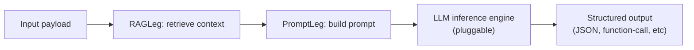
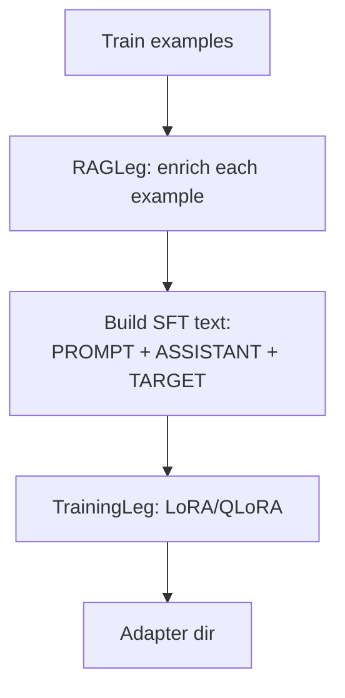

# LLM Tripod

Tripod is a small, modular **LLM integration-test harness** that separates the pipeline into three “legs”:

1. **Training (Leg 1)**: Fine-tune a small LLM with LoRA/QLoRA (`core/training.py`).
2. **RAG (Leg 2)**: Retrieve relevant reference snippets from a local vector store (`core/rag.py`, `core/vectordb.py`).
3. **Prompting (Leg 3)**: Build a deterministic prompt + output schema (`core/prompting.py`).

Use it to run repeatable end-to-end experiments and iterate on **data, retrieval, and prompting** until the target task meets your metrics.

## Repository Structure

- `main.py`: `TripodOrchestrator` entry point (inference prints the final prompt; LLM inference call is intentionally a placeholder).
- `core/`: implementations for `TrainingLeg`, `RAGLeg`, `PromptLeg`, plus config models.
- `configs/`: YAML configs (put hardcoded values and YAML knobs here).
  - `configs/smoke_config.yaml`: end-to-end smoke test config.
  - `configs/iot_domain_config.yaml`: example config (IoT-themed; treat as inspiration).
- `scripts/`:
  - `scripts/e2e_smoke.py`: full integration test (dataset → RAG ingest → SFT training → eval → report).
  - `scripts/generate_smoke_dataset.py`: synthetic dataset + RAG doc generator (example task).
- `training_data/`: local artifacts (ignored by git). Smoke reports land under `training_data/smoke/reports/`.

## Glossary (Key Terms)

- **Base model**: the pretrained checkpoint (`training.base_model`), e.g. `TinyLlama/TinyLlama-1.1B-Chat-v1.0`.
- **Adapter**: LoRA/QLoRA weights saved to `training.adapter_output_dir`.
- **Tuned model**: base model + adapter loaded together (via `peft.PeftModel`).
- **RAG context**: retrieved text inserted into the prompt (domain rules, docs, examples, guidelines).
- **With RAG / without RAG**: ablation toggle that either injects retrieved context into the prompt or leaves it empty (applied at inference/eval time; training can still be RAG-enriched).
- **Holdout IDs / `--holdout-policies`**: example smoke-dataset setting where evaluation uses document IDs that never appear in training (forces generalization via retrieval instead of memorization). In your domain, “IDs” could be SKUs, policy numbers, error codes, etc.
- **Evaluation passes**:
  - `base_with_rag`, `base_without_rag`, `tuned_with_rag`, `tuned_without_rag`
- **Metrics** (from `scripts/e2e_smoke.py`):
  - `action_acc`: exact match on the parsed `action` field.
  - `param_acc`: schema-specific parameter match (exactness/tolerance rules live in the evaluator).
  - Task-specific subset metrics are encouraged (example: “param_acc on only the ‘set profile’ action”).

Important: with **holdout enabled**, “without RAG” metrics can be low by design (the prompt may not contain the missing information).

## Flow of Information (When Legs Run)

### Inference (runtime on device)



- Runs **sequentially**: RAG → Prompt → LLM.
- In `main.py`, the “LLM inference engine” is a placeholder that prints the prompt for inspection.

### Training (offline on GPU node)



- Runs **in phases**: ingest → build training file → train. It’s not interleaved with inference.
- The smoke test uses a response delimiter `ASSISTANT:` and masks the prompt tokens during training (completion-style SFT).
- In the smoke pipeline (`scripts/e2e_smoke.py`), RAG enrichment happens when building the training file; if `rag.enabled` is false or ingestion is skipped, training examples get empty context.

### Evaluation (smoke test)

- Runs **four sequential loops** over the eval split:
  - base/tuned × with/without RAG.
- Reports are persisted so you can disconnect SSH and inspect later.
- The "with_rag" passes inject retrieved context at prompt time; the "without_rag" passes force empty context regardless of how the training data was built.

For more detail on flows and feature flags, see `FLOW_OF_INFORMATION.md`.

## Setup

Create and activate a venv, then install deps:

```bash
python3 -m venv .venv
source .venv/bin/activate
pip install -U pip
pip install -r requirements-train.txt
```

Notes:
- Training downloads models from Hugging Face and caches them under `~/.cache/huggingface/` by default (override with `HF_HOME`).
- QLoRA (4-bit) activates automatically when CUDA is available.

## Running

### Prompt-only inference scaffold (no LLM call yet)

```bash
python3 main.py
```

This prints the final prompt after running RAG + prompting, so you can validate the “context → prompt” wiring.

### DSPy prompting

Set `prompting.backend: "dspy"` and configure a DSPy LM before running inference:

```python
import dspy

# Configure your LM before calling TripodOrchestrator.execute(...).
dspy.settings.configure(lm=...)
```

Tripod will return the DSPy prediction string. Use `prompting.backend: "raw"` for prompt-only rendering.

### End-to-end smoke (recommended)

```bash
python3 scripts/e2e_smoke.py --n 6000 --eval-samples 200
```

Useful flags:
- `--num-policies 50`: number of distinct policy docs (example generator).
- `--holdout-policies / --no-holdout-policies`: whether eval uses unseen document IDs (example generator).
- `--report-dir <path>`: override report output location.
- `--no-save-predictions`: skip writing per-sample JSONL (faster, smaller).

Note: `--num-policies`/`--holdout-policies` apply to the **bundled smoke dataset generator**. For your own task, create a generator script (or point to your dataset) and adjust parsing/eval accordingly (see below).

After a run, inspect:
- `training_data/smoke/reports/<run_id>/summary.md` (human-readable)
- `training_data/smoke/reports/<run_id>/summary.json` (machine-readable)
- `training_data/smoke/reports/<run_id>/run.log` (full logs)
- `training_data/smoke/reports/<run_id>/predictions/*.jsonl` (prompt, retrieved context, outputs)

## Interfacing With Tripod (Entry Points)

- `TripodOrchestrator.execute("ingest", {"documents": [...]})`: build the local vector store.
- `TripodOrchestrator.execute("train")`: run LoRA/QLoRA training (expects `training.dataset_path`).
- `TripodOrchestrator.execute("inference", {"domain": "...", "sensor_data": {...}})`: runs RAG + prompting and prints the prompt (LLM call is intentionally pluggable).
- `scripts/e2e_smoke.py`: the most complete “batteries-included” entry point for integration testing (data generation + training + evaluation + report).

## Configuration (YAML)

Tripod is configured via YAML under `configs/`. The key knobs:

- `training.hyperparameters`: batch/epochs/seq length/optim + SFT settings
  - `response_marker`: delimiter used to split prompt vs completion (default `\nASSISTANT:\n`)
  - `mask_prompt`: if true, only the completion contributes to loss
- `rag.retrieval.top_k`: how many docs to retrieve
- `prompting.system_prompt` + `prompting.user_prompt_structure`: output schema and instructions
- `prompting.backend`: `raw` (template rendering) or `dspy` (DSPy program)
- `prompting.dspy`: DSPy-specific knobs like `instructions`, `chain_of_thought`, and `output_field`

Use `configs/smoke_config.yaml` as a working template.

## Adapting To Your Domain

The bundled `scripts/e2e_smoke.py` is a scaffold: it shows the “shape” of an integration test, but **your schema + metrics are task-specific**.

Typical steps:

1. **Define your output schema** (JSON, tool-call, etc) in `configs/smoke_config.yaml` (`prompting.system_prompt`).
2. **Provide training/eval data**:
   - If you keep the JSONL approach, generate `train.jsonl` / `test.jsonl` with your fields and ground truth.
3. **Update parsing + scoring**:
   - `scripts/e2e_smoke.py::parse_action` and `scripts/e2e_smoke.py::evaluate` should reflect your schema and tolerances.
4. **Decide what RAG means for your domain**:
   - Ingest your docs/snippets with metadata, and filter/retrieve appropriately in `_build_rag_context`.

## Example Task (Current Smoke Dataset)

The default generator (`scripts/generate_smoke_dataset.py`) is IoT-themed (“Thermal Control”) and uses “policies” as RAG documents that contain numeric parameters. Treat this as an **inspirational example**: in your domain, “policies” could be pricing tables, rules, SOPs, or any other retrieved reference material.

## Observability & Debugging

Where to look when something is off:

- **RAG quality**
  - Logs: `core.rag` (“Retrieving top k…”)
  - Artifacts: vector store at `rag.vector_db_path` (`docs.jsonl`, `embeddings.npy`)
  - Smoke: check `predictions/*.jsonl` → `rag_context` for wrong/missing retrieval.
- **Prompting quality**
  - Logs: `core.prompting` (“Constructing prompt…”)
  - Smoke: check `predictions/*.jsonl` → `prompt` for schema drift or bad formatting.
- **Training quality**
  - Logs: `core.training` + Trainer loss lines in `run.log`
  - If outputs stop being JSON, first verify the SFT delimiter (`ASSISTANT:`) is present in both training data and eval prompts.
- **Evaluation quality**
  - `summary.json` contains all run args (including holdout settings) and per-pass metrics.

If you want more verbosity, change `logging.basicConfig(level=logging.INFO, ...)` to `DEBUG` in the relevant entry script (e.g., `scripts/e2e_smoke.py`).
